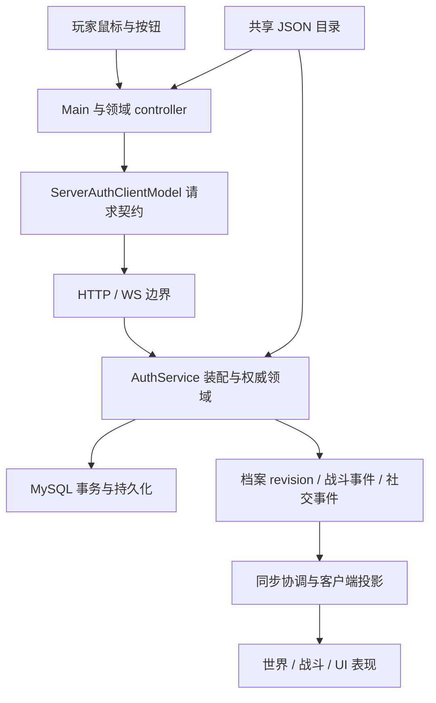

# 架构与功能定位

正常玩家路径是 Godot 客户端 → Node 权威服务 → MySQL。客户端提交操作意图并展示服务器结果；本地模型、缓存、预览和 QA 不能替代联机权威写入。代码索引只覆盖当前工作区，版本差异先看 [项目现状](project-status.md)。

## 运行链路

[Main.tscn](../client/godot/scenes/Main.tscn) 有意保持为 bootstrap。运行时场景、面板和协调主要来自脚本；看见空场景不意味着系统缺失。

PC 客户端默认使用 Godot Compatibility 渲染器。`project.godot` 同时声明 `GL Compatibility` 功能标记和 `gl_compatibility` 方法；当前 macOS 原生验证对应 `opengl3` 驱动。世界、人物、战斗和 UI 仍走原有 2D CanvasItem 路径，地图、比例、相机与玩法规则不随渲染后端改变。选择依据、普通 CPU 对照及当前验收范围见 [Phase 601](phase_601_compatibility_renderer.md)；不要把固定步长脚本耗时当作实际显示帧率或多人容量。

## 客户端的职责边界

| 位置 | 职责与关键入口 |
| --- | --- |
| [main.gd](../client/godot/scripts/main.gd) | 启动、宿主状态、输入分发与领域接线；现有大入口，不是新增业务的默认位置 |
| [world/](../client/godot/scripts/world/) | MapDataCatalog 地图注册、MapRegionCatalog 区域、MapRoutePlanner 寻路、交互和渲染 |
| [battle/](../client/godot/scripts/battle/) | 动作/状态/战斗模型、布局、服务端房间状态与回放协调 |
| [progression/](../client/godot/scripts/progression/) | 档案投影、背包、装备、任务、宠物培养和请求/响应契约 |
| [net/](../client/godot/scripts/net/) | ServerSyncCoordinator、选角、在线状态、断线重连、幂等读取重试 |
| [ui/](../client/godot/scripts/ui/) | 控件、presenter、面板 controller 和 PanelRegistry；显示层不拥有货币或物品权威 |
| [player/](../client/godot/scripts/player/)、[pet/](../client/godot/scripts/pet/) | 人物/骑乘/宠物表现、资产目录、锚点和发布门 |
| [audio/](../client/godot/scripts/audio/) | 音频目录、总线、运行时管理与生命周期 |
| [qa/](../client/godot/scripts/qa/) | 自动检查和专用审查入口；不进入普通玩家 UI |

隔离联机审查由 `guardian_battle_review.gd` 启动真实 Main 和权威本地队伍。守护战自动输入与跨层返程分别由 `guardian_battle_playthrough.gd`、`cave_journey_playthrough.gd` 承担；Python 验证器将 Main 快照与服务端回合／胜负记录交叉核对。这些脚本不进入普通玩家路径，也不提供性能或所有者美术批准，见 [Phase 592](phase_592_cave_return_playthrough.md)。

`main.gd`、`panel_flow_coordinator.gd`、`auto_check_coordinator.gd` 都是现存宿主耦合大文件。新逻辑应进入责任明确的领域模块，再由宿主转发；不能只把逻辑从一个大协调器挪进另一个。

启用美术的地图由 [WorldGroundLayer](../client/godot/scripts/world/world_ground_layer.gd) 保留背景和地面绘制。[MapGroundMesh](../client/godot/scripts/world/map_ground_mesh.gd) 按原图集与叠放顺序合并地面几何，只在地图修订变化时重建；背景范围变化只刷新绘制，特殊裁切／翻转和子图集继续走原区域绘制器。路径等动态反馈仍由 Main 绘制，人物与物件由 WorldDepthLayer 排序。未启用美术继续走原网格回退。变更地面数据时必须沿用地图修订失效链路，避免只重绘 Main 而留下旧缓存。

WorldDepthLayer 为注册人物保留带类型的脚点深度与可见性记录，成员仅在注册时按 stableId 排序；晚序回调仍读取实时脚点方法／元数据，移动或显隐变化后生成原有三位小数签名。替换同名人物强制刷新，同帧释放多个节点也完整清理。不要把元数据或动态脚点当成永久常量；回归与前后证据见 [Phase 600](phase_600_retained_actor_depth_state.md)。

[WorldOverlayLayer](../client/godot/scripts/world/world_overlay_layer.gd) 保留设施名称与原锚点，名称和玩家轮廓相交时上移避让，离开后恢复。读取玩家已有的轮廓缓存，几何不变时不遍历标签；文字实际控件尺寸及 `resized` 信号参与缓存失效，不能只用请求的最小高度。避让只移动显示节点，不改碰撞、点击位置或目标圈，见 [Phase 606](phase_606_world_marker_player_visibility.md)。

[WorldPresentationProfile](../client/godot/scripts/world/world_presentation_profile.gd) 集中解析地图相机策略，缩放、锚点、地标构图和端点资格共用同一入口。按当前地图字段即时判断，保留各地图的正式／预览边界；增加地图策略时同步扩展生命周期状态检查，见 [Phase 578](phase_578_camera_policy_dispatch.md)。

[WorldIdleRenderController](../client/godot/scripts/world/world_idle_render_controller.gd) 在世界镜头完全停稳后暂停 Camera2D 的重复内部更新，普通空闲运行再启用按需绘制。目标、缩放、视口或外部变换改变时恢复相机；未支持的相机模式继续走引擎更新。Main 保持原有 30/60 FPS 处理预算，有效移动点击立即恢复活动预算，退出时还原全局渲染设置。性能探针和审查捕获支持运行中启用，并要求连续绘制；定长探针结束统计后，音频清理到 Main 退出之间仍须绘制。`--write-movie` 在启动时固定连续绘制。正常运行的节能收益另用正常时钟测量。回归扩展在 `--auto-camera-check`，不新增玩家设置或测试入口参数。

[BattleTexturePrefetcher](../client/godot/scripts/battle/battle_texture_prefetcher.gd) 预取当前地图、宠物和同屏人物的战斗贴图。每个成功提交的线程请求必须领取一次结果，包括加载失败的请求；切图取消保持异步，节点退出才等待并回收剩余最多四个请求，见 [Phase 570](phase_570_prefetch_request_cleanup.md)。

[ServerBattlePlaybackQueue](../client/godot/scripts/battle/server_battle_playback_queue.gd) 保存动画期间收到的后续权威回合。ServerBattleCoordinator 在当前回合完成后逐个接续，队列排空再结算；最新房间快照与当前播放回合分开保存，进出战斗清空队列。128 回合恢复窗口及逐回合实机核对见 [Phase 589](phase_589_ordered_server_battle_playback.md)。联网倒计时按服务器截止时间显示，到时等待权威结果；当前回合只允许完成一次，空边界不重复应用快照，见 [Phase 590](phase_590_authoritative_battle_timeout.md)。

[BattleOutcomeFloatOverlay](../client/godot/scripts/ui/battle_outcome_float_overlay.gd) 只播放世界中的只读结算视图。PFC 进入新战斗时取消展示与待播队列但保留奖励 ID 去重；组件按播放代次隔离旧异步回调，并持有淡出中的行直到释放。五行队列、标题和退出行的布局在正常 1280×720 下逐帧检查，见 [Phase 604](phase_604_battle_outcome_lifecycle.md)。不要让显示取消变成奖励回滚或重新结算。

宠物身体倍率由 PetBattleSpriteScaleCatalog 在战斗准备时加载；正式 profiles 与显式 QA previewProfiles 分开，绘制只读取已准备的内存数据。候选倍率不能启用素材或改变权威战斗几何，见 [Phase 591](phase_591_sunbaked_candidate_battle_scale.md)。

人物世界动画由 [Player](../client/godot/scripts/player/player.gd) 缓存当前形象的朝向／动作片段。帧率和纹理引用在片段首次使用时从 CharacterActionAssetCatalog 解析，逐帧只按原有时间选帧；切换形象会清空旧片段。目录在单次运行中保持不变，如后续增加运行时素材热更新，必须同步增加动画缓存失效入口。验证见 [Phase 572](phase_572_world_animation_hotpath.md)。

Main 的人物外观选择按档案中原始 `appearanceId` 缓存解析结果。每次仍读取字段，以兼容整体换档与嵌套字典原地修改；空白和未知 ID 继续由目录统一处理。若增加目录热更新，需同时失效这份缓存。验证见 [Phase 577](phase_577_player_appearance_selection_cache.md)。

Player 的边界校正仅在校正坐标与当前位置精确不同时赋值，避免每个物理帧触发重复变换通知。边界、速度与目标规则保持一致，见 [Phase 574](phase_574_player_position_updates.md)。

人物轮廓查询键随形象／朝向／动作改变，相机签名另外包含骑乘形态。遮挡只缓存源图到局部范围的换算，并比较实际范围、贴图尺寸、绘制矩形与翻转；每次仍应用当前全局变换，不缓存世界坐标。未准备的动作保持保守范围，遮挡查询不扫描图片。验证见 [Phase 575](phase_575_player_visual_bounds_reuse.md)。

[PanelRegistry](../client/godot/scripts/ui/panel_registry.gd) 根据面板显隐及进出场景的信号使菜单状态缓存失效，未变化时查询不再遍历全部控件。注册必须经过 `set_world_menu_panels()` / `add_world_menu_panel()`，已有面板数组用于枚举读取。点击命中仍使用原递归检查，验证见 [Phase 573](phase_573_panel_visibility_hotpath.md)。

## 服务端的职责边界

| 位置 | 职责 |
| --- | --- |
| [http-server.js](../server/node/src/http-server.js) | HTTP 路由、请求上下文、协议边界、WS 装配和服务生命周期 |
| [http-list-options.js](../server/node/src/http-list-options.js) | 邮箱/归档/奖励仓 URL 查询适配；领域模块继续负责分页规则 |
| [auth-service.js](../server/node/src/auth-service.js) | 服务装配、共享权威根、依赖注入、现存兼容与归一化 |
| [auth/](../server/node/src/auth/) | 账号角色、档案动作、战斗、宠物、经济、邮件、队伍、家族等领域 |
| [mysql-store.js](../server/node/src/mysql-store.js) | 当前运行时 schema、读取、增量差异、事务与保存；并非早期 SQL 文件 |
| [event-hub.js](../server/node/src/event-hub.js) | 已授权事件的扇出；不能成为另一套修改状态的入口 |
| [protocol.js](../server/node/src/protocol.js) | HTTP/WS 协议窗口，与客户端常量共同维护 |
| [scripts/](../server/node/scripts/) | 本地运维、迁移与专项审计；执行前区分玩家环境和一次性 QA |

## 按需求找代码和回归

表中列代表入口；进入模块后沿调用关系找消费者，完整列表见 [代码索引](reference/code-index.md)。

| 要修改的功能 | 客户端起点 | 服务端起点 | 回归入口 |
| --- | --- | --- | --- |
| 登录、建角、选角 | [character_entry_coordinator.gd](../client/godot/scripts/net/character_entry_coordinator.gd)、[请求契约](../client/godot/scripts/progression/server_auth_client_model.gd) | [account-characters.js](../server/node/src/auth/account-characters.js) | [auth-account-characters.test.js](../server/node/test/auth-account-characters.test.js) |
| 地图、移动、NPC 交互 | [MapDataCatalog](../client/godot/scripts/world/map_data_catalog.gd)、[MapRoutePlanner](../client/godot/scripts/world/map_route_planner.gd) | [auth-service.js](../server/node/src/auth-service.js) 的位置/移动入口和共享地图读取 | [auth-social-world.test.js](../server/node/test/auth-social-world.test.js)、地图/移动自动检查 |
| 同屏玩家外观 | [RemotePlayerVisual](../client/godot/scripts/world/remote_player_visual.gd) 复用 Player；WorldDepthLayer 按账号更新节点 | [online-player-appearance.js](../server/node/src/auth/online-player-appearance.js) 的档案投影与提交后通知，online-presence 的公开字段白名单 | online-player-appearance.test.js；map-visual-runtime 内的远端人物检查；[Phase 563](phase_563_remote_player_appearance.md) |
| 战斗指令与回合 | [battle/](../client/godot/scripts/battle/) | [battle-room.js](../server/node/src/auth/battle-room.js)、同目录规则模块 | [auth-battle-room.test.js](../server/node/test/auth-battle-room.test.js) |
| 宠物成长、捕捉、转生、进化、融合 | [progression/](../client/godot/scripts/progression/)、[pet/](../client/godot/scripts/pet/) | `auth/pet-*`、`new-pet-factory.js` | 按领域检索 `server/node/test/*pet*`；先用宠物 Skill 定义契约 |
| 背包、装备、商店、交易 | [PlayerProgressModel](../client/godot/scripts/progression/player_progress_model.gd)、对应 presenter/controller | [economy.js](../server/node/src/auth/economy.js)、装备/货币/资产模块 | [auth-economy.test.js](../server/node/test/auth-economy.test.js)、对应 MySQL 事务测试 |
| 任务和挂机 | [progression/](../client/godot/scripts/progression/)、[net/](../client/godot/scripts/net/) | [quest.js](../server/node/src/auth/quest.js)、[profile-actions.js](../server/node/src/auth/profile-actions.js)、[offline-hang.js](../server/node/src/auth/offline-hang.js) | 对应 quest/hang 测试与自动检查 |
| 邮件、聊天、奖励仓 | [ServerSyncCoordinator](../client/godot/scripts/net/server_sync_coordinator.gd)、对应 UI | [mail-chat.js](../server/node/src/auth/mail-chat.js)、`mail-*`、`reward-vault-*` | [auth-http-server.test.js](../server/node/test/auth-http-server.test.js)、邮件/奖励仓存储测试 |
| 队伍、家族和庄园 | 对应 UI 与同步模块 | [party.js](../server/node/src/auth/party.js)、[family-manor.js](../server/node/src/auth/family-manor.js) | party/family/manor 测试与联机检查 |
| 音乐、音效 | [game_audio_manager.gd](../client/godot/scripts/audio/game_audio_manager.gd) | 通常只消费权威玩法事件，不增加结算权威 | 音频 Skill 管线与 audio 自动检查 |

## 必须一起维护的契约

- **共享内容**：[data/](../client/godot/data/) 的地图、动作、宠物、物品、任务和数值 JSON 有双端消费者。先查 ID、schema 和引用，再更改。
- **协议**：[客户端模型](../client/godot/scripts/progression/server_auth_client_model.gd) 的客户端协议号与服务端协议窗口配套。UI、资源或兼容修复本身不要求升级协议；不要在多个手册里手写重复版本号。
- **档案**：玩家全量 `PUT /profiles/me` 被禁用；使用领域接口或白名单 `/profile/action`，应用返回的权威档案和 revision。异步拉取不能覆盖进行中的修改。
- **持久化**：新实体需要覆盖 normalize、snapshot、MySQL schema/load/diff/save 和测试；保持增量写。位置、邀请、战斗运行态和面对面交易报价按既定合同不直接持久化。
- **资产**：运行资源、生产源、冻结证明和候选批准是不同职责；遵循包的 catalog、manifest、provenance 和发布门。

## 性能与表现

`_process`、`_input`、`_draw`、HUD/世界签名、任务文字、路线状态、marker 和事件轮询都是热点。禁止在其中做全档案 normalize、全表扫描、文件/网络 I/O 或大段文本构建；改用事件驱动、dirty 标记和缓存。

玩家主要流程应在 1280×720 下用左键/按钮完成。正常 UI 不显示原始错误码、QA 指令或调试字段。涉及这些流程的修改需要真实 Main 体验及修改前后的静止、移动和相关压力证据，见 [测试指南](testing.md)。

维护拆分顺序见 [维护清单](maintenance.md)。历史设计理由通过 [阶段索引](reference/phase-index.md) 查阅，不把旧 Phase 行号当作当前代码位置。
